Opa tudo certo !?
eu sou o Z
subi esse domino com quartz para expor minhas ideias e amadurecelas em publico e para criar tutorias para melhorar a minha escrita e a minha capacidade de criar um conteudo relevante e
de facil acesso para min mesmo por meio de anotacoes, memorias e backlinks -> ['backlinks'](https://obsidian.md/help/plugins/backlinks)

> [!info] Work In Progress
> Esse dominio sofre sofre de constantes mudancas tempo, farei as manutencoes dessas notas apenas quando tiver tempo e vontade...

---

## Por onde entrar

| Porta | O que tem |
|---|---|
| [[method]] | **Comece aqui.** Como este jardim funciona e por quê |
| [[now]] | O que está em andamento neste momento |
| [[learning-in-public]] | Aprender em público — o princípio |
| [[consume-less-produce-more]] | A assimetria entre consumir e produzir |
| [[internet-finds]] | Mapa de achados da internet, catalogados e descritos |
| [[self-hosted-habbo-server]] | Build log de projeto |

## O jardim

```
seeds/      🌱  captura sem fricção — pode ser só uma pergunta
saplings/   🌿  um conceito por nota, em crescimento
fruits/     🌳  acabado, ensinável, publicável
projects/       build logs com começo, meio e fim
logs/           learning logs, revisão semanal, /now
internet-finds/ catálogo do que vem de fora
about/          o próprio jardim
```

Pastas marcam **estágio**, não tópico. Tópico vem de tags e links —
o motivo está em [[method]].

## Mapa

```mermaid
flowchart TD
    H(["🏡 thisdev.notes"])

    H --> M["method"]
    H --> N["now"]
    H --> L["learning-in-public"]
    H --> C["consume-less-produce-more"]
    H --> IF["internet-finds"]
    H --> P["self-hosted-habbo-server"]
    H --> Seeds["🌱 seeds"]
    H --> Sap["🌿 saplings"]

    IF --> IF1["sites"]
    IF --> IF2["cool web tools"]
    IF --> IF3["cool_articles"]

    Seeds --> S1["rss-over-algorithms"]
    Seeds --> S2["shrine"]
    Seeds --> S3["design-system"]
    Seeds --> S4["youtube-channel"]
    Seeds --> S5["ditcher"]

    Sap --> SA1["selfhost"]

    click M "/about/method" "Como este jardim funciona"
    click N "/logs/now" "O que está em andamento"
    click L "/about/learning-in-public" "Aprender em público"
    click C "/saplings/consume-less-produce-more" "Consumir x produzir"
    click IF "/internet-finds/" "Mapa de achados"
    click P "/projects/self-hosted-habbo-server" "Build log"
    click IF1 "/internet-finds/sites/" "Sites catalogados"
    click IF2 "/internet-finds/cool-web-tools/" "Ferramentas"
    click IF3 "/internet-finds/cool_articles/" "Artigos"
    click S1 "/seeds/rss-over-algorithms" "RSS no lugar do algoritmo"
    click S2 "/seeds/shrine" "Shrine"
    click S3 "/seeds/design-system" "Design system"
    click S4 "/seeds/youtube-channel" "Canal no YouTube"
    click S5 "/seeds/ditcher" "Editor de imagem"
    click SA1 "/saplings/selfhost" "Self-hosting"
```



## Sementes plantadas

- [[rss-over-algorithms]] — trocar a home do YouTube por um feed que eu escolhi
- [[plant-care-routine]] — jardinagem literal
- [[high-volume-data-handling]] — resposta rápida com altos volumes de dados
- [[design-system]] — padronizar a estética do thisdev.space
- [[thisdev-space]] — o domínio-mãe
- [[ditcher]] · [[photo-editor]] — ferramenta de edição sem fricção
- [[youtube-channel]] · [[youtube-radio]] · [[nix-livestream]] — ensinar em voz alta
- [[writing-routine]] — cadência de escrita pra este vault
- [[shrine]] — entender por que eu gosto do que eu gosto

---

ultimamente venho sentimento de estagnação de consumo de conteúdo, sinto que não consigo mais consumir algo por mais de 10 min e etc, por isso quero
iniciar criação conteúdo algum tipo de conteúdo e esse site vai me *ajudar a organizar os meus habitos online, * como mapa para navegar em sites e subir web services. o que quero fazer, o que ? ainda não sei vou descobrindo com o tempo e desenvolvimento.

vou come limitando o conteúdo que eu consumo, excluindo a maioria dos algoritmos de recomendação

para gastar menos tempo "procurando coisa para consumir" e ficar de uma forma se eu naos estou consindo, estou produzindo e ter mais tempo para produizer nao consumindo
